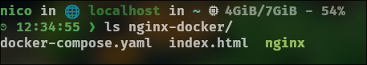
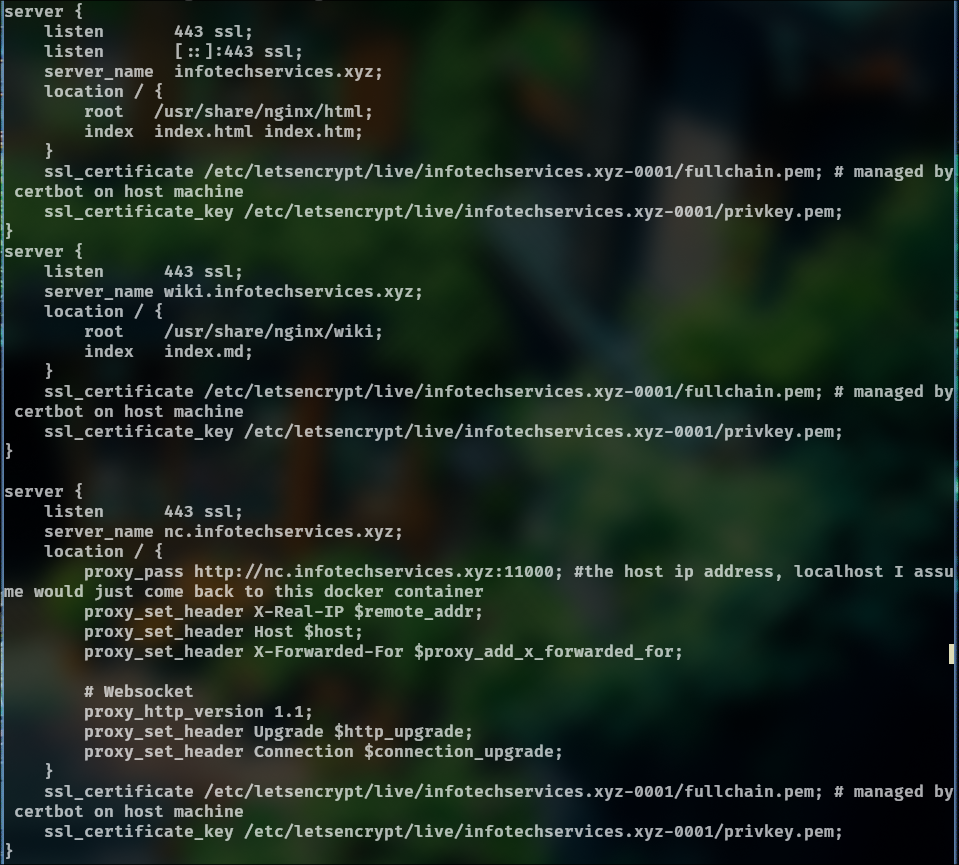
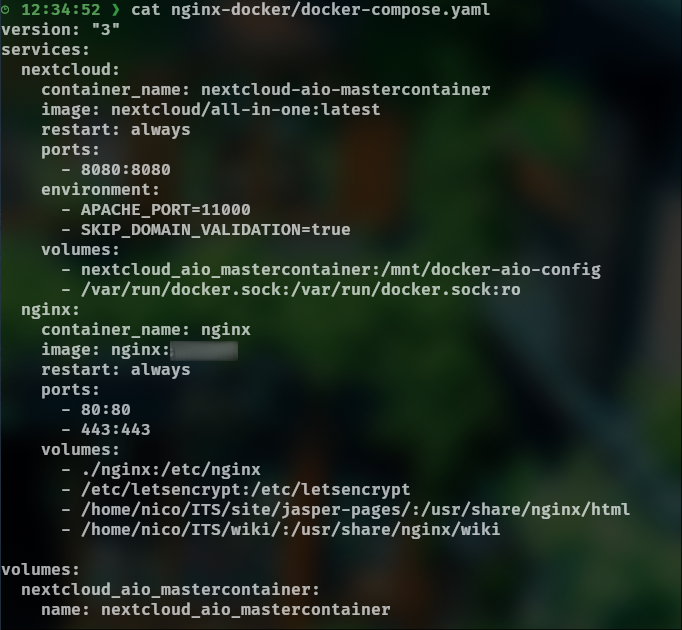
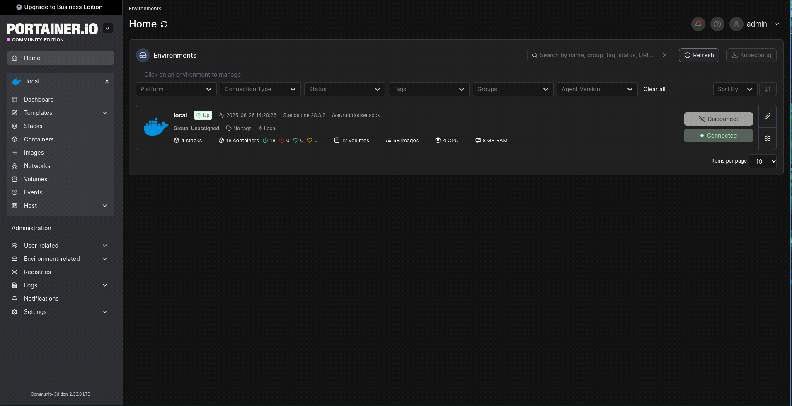
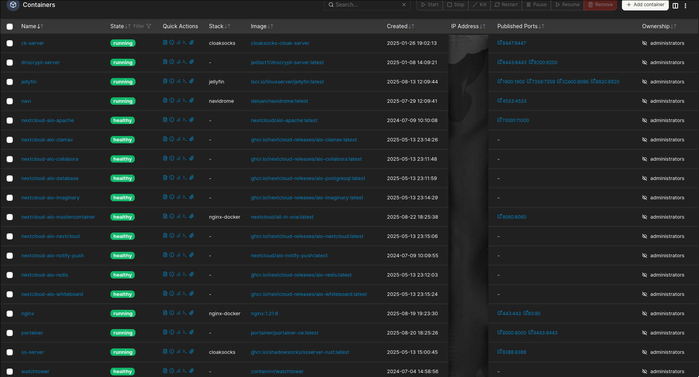

# Présentation de mon VPS et mise en œuvre d'une solution cloud personnelle

Un **VPS (Virtual Private Server)** est un serveur virtuel privé que l’on peut louer auprès d’hébergeurs tels qu’OVH, Ionos ou Linode. Il permet de disposer d’un serveur sur Internet, accessible à distance, avec un contrôle complet sur son fonctionnement et souvent pour pas très cher.

## Pourquoi avoir un VPS personnel ?

Avoir un serveur personnel offre de nombreuses possibilités :

- **Héberger son propre site internet** selon ses propres règles.

- **Déployer des solutions variées** pour différents usages : sauvegardes, réseau privé (VPN, DNS, proxy…), ou expérimentations techniques.

- **Contrôler la sécurité et la configuration** : contrairement à des solutions toutes faites, vous pouvez ajuster votre serveur selon vos besoins et vos préférences.

Avec des services prêts à l’emploi comme Wix, Webador ou Canva, vous n’avez pas forcément de contrôle sur le serveur ni sur certaines fonctionnalités avancées. Créer son site sur un VPS vous permet de choisir les technologies que vous utilisez et d’apprendre beaucoup sur la gestion d’un serveur.

## Avantages et apprentissage

Même si cela demande plus de temps et un minimum de compétences techniques, la satisfaction de créer quelque chose “à la main” est bien plus grande que celle d’utiliser une solution clé en main. L’expérience acquise en configurant, sécurisant et maintenant votre serveur est très enrichissante et vous donne une autonomie réelle sur vos projets en ligne.

## Mon VPS

Comme vous pouvez le constater je tourne mon serveur sur un Rocky Linux (base RPM) et au niveau GPU et CPU ont comprend bien que le matériel est louer et virtualiser, on retrouve KVM/QEMU pour la virtualisation.
> Les processeurs AMD EPYC sont souvent utiliser pour les serveurs ou des solutions Cloud.

### Que contient mon serveur ? 
Des dossiers de mes _projets_ comme sur l'image suivante. Et aussi pas mal de fichiers de configurations.

La commande `ls nginx-docker` affiche tous ce qu'il y a dans le dossier 'nginx-docker'.

Ainsi il y a 2 solutions différentes que je vais vous présenter et qui sont très utilisés
dans les milieux clouds (même si pas forcément présenté comme moi).

### Nginx et Docker
---
#### Nginx

Nginx (prononcé "engine x") est un logiciel libre de **serveur web et de reverse proxy.**

Il permet de :

1. **Lancer un serveur web HTTP** pour servir des pages ou applications.

2. **Rendre accessibles des serveurs ou applications internes** via un reverse proxy.

Cette approche me permet d'être assez flexible et de privilégier la sécurité de mon infrastructure. Comme cela je ne déploie pas mes serveurs avec le risque qu'ils soient exploités, si par exemple une mise à jour compromettante rends un de mes services exploitable.
> ⚠️ Cela ne représente qu'un seul aspect de la sécurité, il y a toujours d'autres endroits à investiguer.

Voici un extrait de mon fichier de configuration nginx:

Le fichier présente 3 Serveurs: 

- 2 en local
- 1 utilisant le reverse proxy

Tous avec **le certificat SSL (HTTPS)** 

- Les 2 premiers indiquent l'emplacement racine `location / root` et l'`index` qui seront affichés comme page web.

- Le `serveur nc.infotechservices.xyz`, utilise la 'commande' `proxy_pass` ainsi **le reverse proxy pointe vers l'adresse locale d'un serveur web qui n'est pas géré directement par nginx.**

> Précisions: 
> 1) Nginx ne lis pas les markdowns le passage écrit `index.md` est une faute de frappe. 
> 2) Ont utilise souvent des adresses ip locales pour le reverse proxy, mais ici j'utilise une autre méthode.

---

#### Docker

Docker est un logiciel qui permet de lancer des applications dans des **environnements appelés “conteneurs”.**

Un **conteneur** est une instance isolée du reste de la machine hôte (ici, mon serveur Rocky Linux). Contrairement à la virtualisation complète, la conteneurisation utilise seulement une partie des ressources du système hôte, ce qui la rend plus **légère et rapide.**

L’intérêt de Docker est de **faciliter et automatiser le déploiement d’applications ou de services.** Plutôt que de configurer un serveur de A à Z à chaque fois, on utilise des **images Docker** existantes et on les déploie en définissant certains paramètres.

Cela permet notamment :

1. Un déploiement de serveur **prévisible et reproductible.**

2. Une application qui fonctionne **rapidement et sans configuration complexe.**

3. Une meilleure **sécurité grâce à l’isolation des conteneurs.**

Pour rendre **Docker** plus *puissant et efficace*, je lui associe deux outils: 
- **Docker-Compose** : outil pour **définir et lancer plusieurs conteneurs ensemble via un fichier de configuration unique.** 
- **Portainer** : interface web pour **gérer et superviser** facilement Docker et ses conteneurs. 

##### Docker-Compose
Voilà à quoi ressemble un fichier docker-compose.yml:

Il y a deux images dockers utilisés Nextcloud et Nginx.
Elles fonctionnent ensembles avec leurs **ports et volumes associés.** 
- **Les ports** permettent de **"rendre publique" le service désiré.** 
- **Les volumes** sont des **espaces de stockages persistant**, les **fichiers** dessus peuvent être **modifier, effacé ou créer.** Et deviennent effectifs au redémarrage du
conteneur. 

> On peut voir les volumes comme des tiroirs externes. Supprimer un conteneur ne supprime pas un volume.

Pour exécuter ce fichier dans le dossier correspondant on utilise la commande `docker compose up -d`

##### Portainer
 *Page d'acceuil de Portainer*

Via ce portail on peut **superviser et gérer** les conteneurs.

*Liste de mes conteneurs*

Ainsi comme vous pouvez le remarqué je peut par exemple **redémarrer, supprimer ou ajouter un nouveau conteneur.**

**Portainer** permet beaucoup d'autres choses, en fin de compte, avec, on peut **utiliser Docker sans forcément passer par la ligne de commande.**

> ⚠️ ***Mon conseil:*** Ne pas se reposer uniquement sur une interface graphique. Utiliser le **terminal + les outils graphiques** pour **comprendre et contrôler** son environnement Docker du
> mieux possible.
